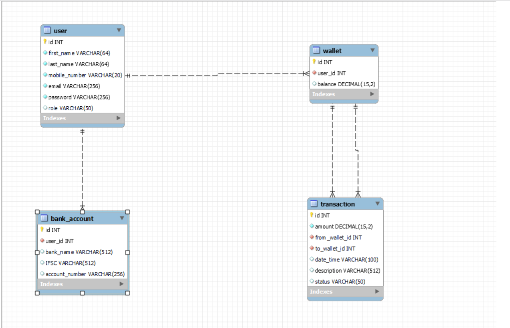
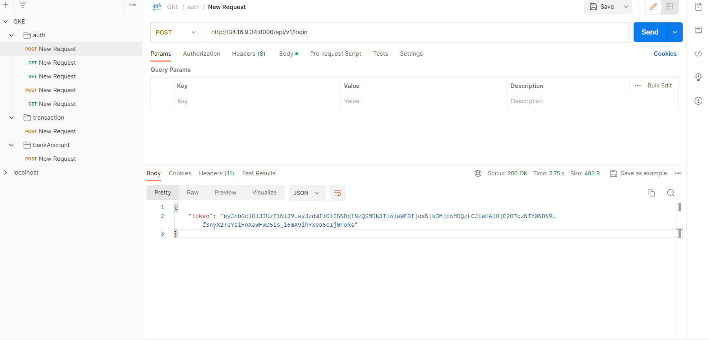
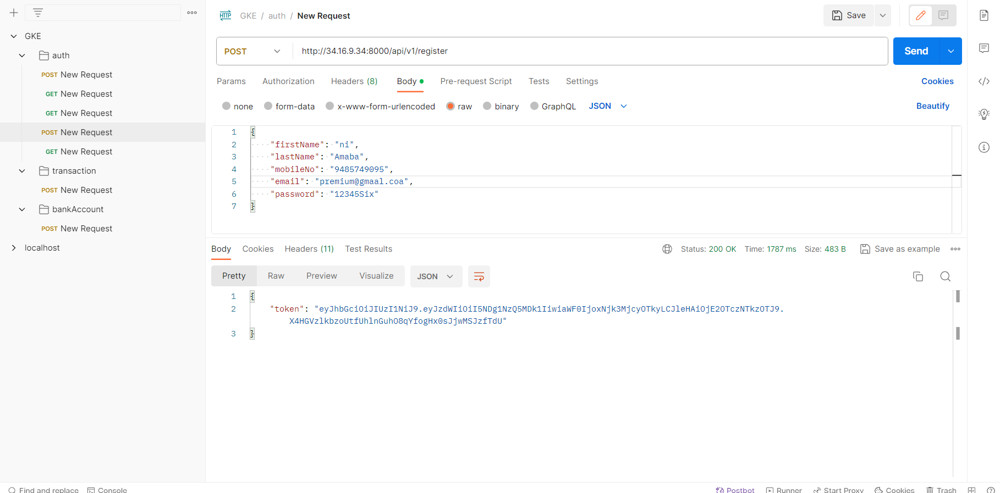

# Payment Wallet/ Mobile Wallet - Microservices Application

This repository contains a Payment Wallet microservices application with three microservices:

1. **Bank Account Microservice**
   - Docker Image: [kuldeepbishnoi/mobilewallet-bankaccount](https://hub.docker.com/r/kuldeepbishnoi/mobilewallet-bankaccount)
   - API Endpoint: Through User API Gateway   

2. **Transaction Microservice**
   - Docker Image: [kuldeepbishnoi/mobilewallet-transaction](https://hub.docker.com/r/kuldeepbishnoi/mobilewallet-transaction)
   - API Endpoint: Through User API Gateway

3. **User Microservice**
   - Docker Image: [kuldeepbishnoi/mobilewallet-user](https://hub.docker.com/r/kuldeepbishnoi/mobilewallet-user)
   - API Endpoint: [http://34.171.215.205:8000/api/v1/](http://34.171.215.205:8000/api/v1/)
      - /login: POST Mapping & {"username": "9485749097", "password": "12345Six"}
      - /balance: GET Mapping & using JWT token that you will receive when you login
      - /wallet: GET Mapping & using JWT token that you will receive when you login
      - /transaction: POST Mapping & {"amount":"70", "toWalletId":"6"}
         - Internal Working:
            - Amount will be blocked
            - if unsucessfull then unblocked
            - if successfull then dedcuted
      - /bankaccount: POST Mapping & {"bankName": "PNB", "ifsc": "2494009909009", "accountNo": "24940079798888"}
      - /register: POST Mapping & {"firstName": "","lastName": "","mobileNo": "","email": "","password": ""}

## Application Architecture

The application's database is deployed on Amazon Web Services (AWS). And Application is deployed on Google Cloud.

## Database Relation

The application's database is deployed on Amazon Web Services (AWS) with the provided entity-relationship diagram. This diagram showcases the database's structure.

## JWT Token Authentication

For user authentication, the application uses JWT token authentication. Below are the images illustrating the login and registration processes:

## Deployment

For scalability and management I have used  kubernetes.
